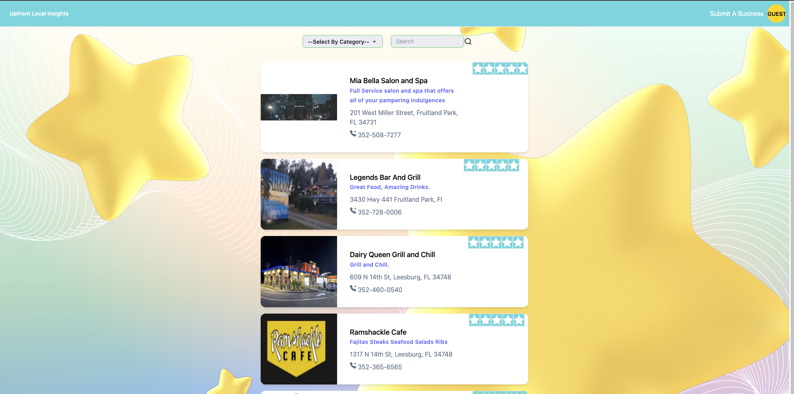

# Upfront-Local-Insights

This project is deployed on an AWS EC2 instance and can be accessed by it's Public IPv4 address: http://54.90.137.205/

---



Upfront Local Insights is a business review website that lets users rate and review businesses. Users can also submit a business (with Photo) if the business is not already listed.

# The Problem

The problem I wanted to solve is simple. I want consumers to be able to write reviews, good or bad and have them seen. Consumers need full transparency. Both Google and Yelp! hide reviews.

Both Yelp! and Google hid reviews on a boarding facility I took our dog to. Had I seen those reviews I may have not taken her there. Our dog escaped this same facility and was hit by a car and injured. My review of this experience was even hidden.

Consumers have a right to know about any reviews being made about a business. My goal is to have a place where users can leave a review, and that review will be seen and not hidden by an algorithm, however, I do believe foul language and slander should be filtered.

# Development

Upfront Local Insights requires [Node.js](https://nodejs.org/) v10+ to run. Tested on version `16.14.2`

This App uses [NPM](https://www.npmjs.com/) Node Package Manager to manage it's dependencies and packages.

from the root directory

```
npm install
```

Create a .env file in the server folder and add your values.

For example:

```
 NODE_ENV=development
 DB_URI=YOUR_URI
 JWT_SECRET=YOUR_SECRET
 REFRESH_EXPIRES_IN=YOUR_VALUE
 REFRESH_TOKEN_SECRET=YOUR_SECRET
 PORT=3001
```

Double check your MongoDB connection URI. For example:

```
DB_URI=mongodb+srv://<username>:<password>@cluster0.qkyacex.mongodb.net/?retryWrites=true&w=majority
```

This App uses `concurrently` to start both the client and server. I have configured the root `package.json` to define workspaces with the client and server. So in the ROOT directory:

```
npm start
```

## Tech Stack

### **Front-End**

---

- [Vite] - build tool that aims to provide a faster and leaner development experience for modern web projects.

- [React] - JavaScript front end library.

- [Tailwind CSS] - A utility-first CSS framework packed with classes like flex, pt-4, text-center and rotate-90 that can be composed to build any design, directly in your markup.

- [DaisyUI] - It is simply a plugin for Tailwind CSS, which works on all frameworks and has made development faster, and customizable for developers using pure CSS.

### **Back-End**

---

- [Mongoose] - Mongoose is an object modeling tool for MongoDB and Node.js.

- [Node.js] - cross-platform, open-source server environment that can run on Windows, Linux, Unix, macOS, and more. Node.js is a back-end JavaScript runtime environment, runs on the V8 JavaScript Engine, and executes JavaScript code outside a web browser.

- [Express] - Express.js, or simply Express, is a back end web application framework for building RESTful APIs with Node.js

- [MongoDB] - MongoDB Atlas is a fully managed cloud database service that allows you to easily deploy, scale, and operate MongoDB databases in the cloud.

### **Deployment tools**

---

- [Nginx] - Nginx is a web server that can also be used as a reverse proxy, load balancer, mail proxy and HTTP cache.

- [AWS EC2] - An EC2 instance is simply a virtual server in Amazon Web Services terminology. With an EC2 instance, AWS subscribers can request and provision a computer server within the AWS cloud.

- [PM2] - PM2 is a daemon process manager that will help you manage and keep your application online 24/7

## Contributing

---

Find a bug?
I welcome contributions. Simply open a pull request with your changes and I will review them.

[tailwind css]: https://tailwindcss.com/docs/guides/vite
[DaisyUI]: https://daisyui.com/
[vite]: https://vitejs.dev/
[mongoose]: https://mongoosejs.com/
[mongodb]: https://www.mongodb.com/
[aws ec2]: https://aws.amazon.com/pm/ec2/?trk=9cd376cd-1c18-46f2-9f75-0e1cdbca94c5&sc_channel=ps&ef_id=CjwKCAjw8-OhBhB5EiwADyoY1QxxcGo4K0YGQjyUr9xX0Ttc1fkrW-xpgjPRjxiHxBuAfvsvbWKh0xoCjfIQAvD_BwE:G:s&s_kwcid=AL!4422!3!651751059309!e!!g!!aws%20ec2!19852662176!145019189697
[node.js]: http://nodejs.org
[nginx]: https://www.nginx.com/
[express]: http://expressjs.com
[react]: https://react.dev/
[pm2]: https://pm2.keymetrics.io/
[http://54.90.137.205/]: http://54.90.137.205/
